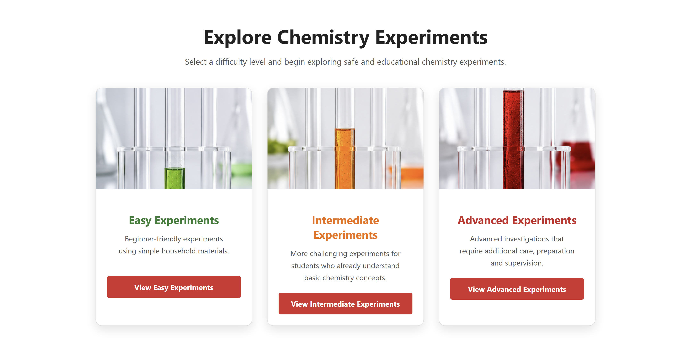
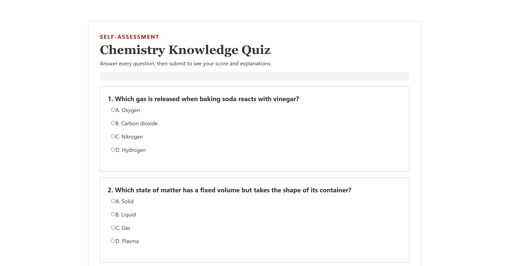
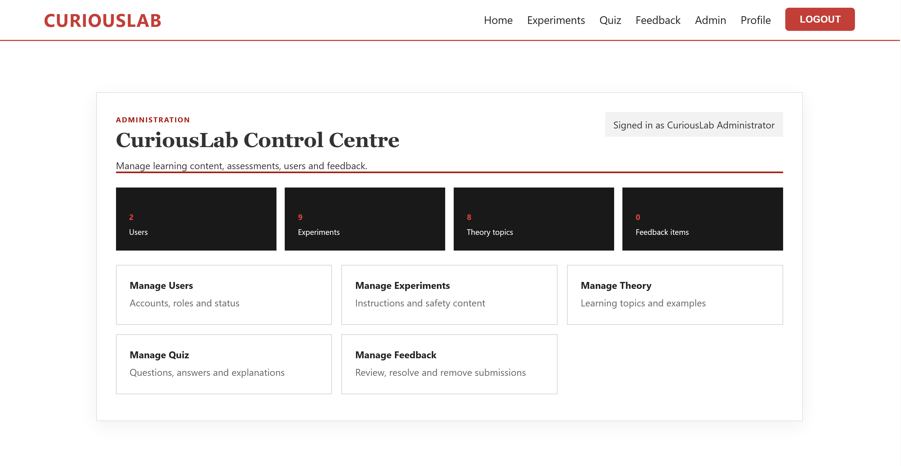

# CuriousLab – Science Learning Platform

CuriousLab is a web-based educational platform that helps students
learn scientific concepts through theory topics, home experiments,
quizzes and interactive features.

## Features

- User registration, login and logout
- Member and administrator roles
- Science theory topics
- Experiments organised by difficulty
- Online quiz system
- User feedback
- Administrator CRUD dashboard
- SQL Server database integration

## Technologies

- ASP.NET Web Forms
- C#
- SQL Server
- HTML
- CSS
- JavaScript

## My Contribution

This was a four-member university group project. I served as the group
leader and developed the home page, master page, login, registration, Theory,
and user-authentication features. I also contributed to database
integration, project testing and documentation.

## Running the Project

1. Open the solution in Visual Studio.
2. Execute the included SQL script in SQL Server.
3. Update the database connection string in Web.config.
4. Build and run the application.

## Screenshots

### Home Page

### Login Page

### Experiments Page

### Quiz Page

### Administrator Dashboard

## Academic Context

Developed as part of the Web Applications module at Asia Pacific
University.
